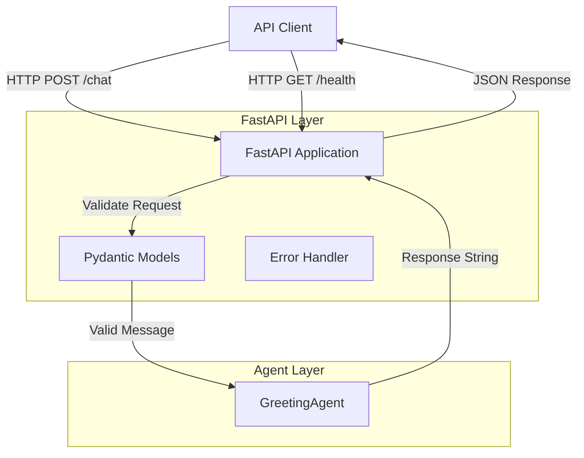

# Design Document: FastAPI Deployment

## Overview

This design specifies the technical architecture for adding FastAPI deployment capabilities to TBBot. The implementation will wrap the existing GreetingAgent in a REST API layer, enabling HTTP-based interaction while maintaining full backward compatibility with the current agent functionality.

The design follows a layered architecture pattern:
- **API Layer**: FastAPI application handling HTTP requests/responses
- **Agent Layer**: Existing GreetingAgent (unchanged)
- **Validation Layer**: Pydantic models for request/response schemas

Key design principles:
- Minimal changes to existing GreetingAgent code
- Clear separation between API concerns and agent logic
- Comprehensive error handling at the API boundary
- Testability using langwatch-scenario framework

## Architecture

### System Components



### Component Responsibilities

**FastAPI Application (`src/tbbot/api.py`)**
- Initialize FastAPI app with metadata
- Define route handlers for /chat, /health endpoints
- Configure CORS middleware (optional)
- Handle HTTP-level errors and status codes
- Provide automatic OpenAPI documentation

**Pydantic Models (`src/tbbot/models.py`)**
- Define `ChatRequest` schema with message field validation
- Define `ChatResponse` schema with response field
- Define `HealthResponse` schema for health check
- Provide automatic JSON validation and serialization

**GreetingAgent (`src/tbbot/greeting.py`)**
- Remains unchanged from current implementation
- Continues to provide `process_message(message: str) -> str` interface
- Maintains existing greeting detection logic

**Error Handler**
- Catch validation errors (422 responses)
- Catch internal errors (500 responses)
- Format error responses with descriptive messages

### Request Flow

1. Client sends HTTP POST to `/chat` with JSON body `{"message": "hello"}`
2. FastAPI receives request and routes to chat endpoint
3. Pydantic validates request body against `ChatRequest` schema
4. If validation fails, return 422 with error details
5. If validation succeeds, extract message string
6. Call `agent.process_message(message)` to get response
7. If agent raises exception, catch and return 500
8. If agent succeeds, wrap response in `ChatResponse` model
9. FastAPI serializes to JSON and returns 200 response

### Deployment Architecture

The FastAPI application will be runnable via:
- Development: `uvicorn src.tbbot.api:app --reload`
- Production: `uvicorn src.tbbot.api:app --host 0.0.0.0 --port 8000`
- Testing: Direct instantiation in scenario tests using TestClient

## Components and Interfaces

### API Module (`src/tbbot/api.py`)

```python
from fastapi import FastAPI, HTTPException
from fastapi.middleware.cors import CORSMiddleware
from .models import ChatRequest, ChatResponse, HealthResponse
from .greeting import GreetingAgent

app = FastAPI(
    title="TBBot API",
    description="Educational AI agent for teaching AI agent development",
    version="1.0.0"
)

# Optional CORS configuration
def configure_cors(app: FastAPI, origins: list[str]) -> None:
    """Configure CORS middleware if needed."""
    pass

# Initialize agent
agent = GreetingAgent()

@app.post("/chat", response_model=ChatResponse)
async def chat(request: ChatRequest) -> ChatResponse:
    """Process student message and return agent response."""
    pass

@app.get("/health", response_model=HealthResponse)
async def health() -> HealthResponse:
    """Health check endpoint."""
    pass
```

**Interface Contract:**
- `POST /chat`: Accepts `ChatRequest`, returns `ChatResponse` or error
- `GET /health`: Returns `HealthResponse` with status
- All endpoints return JSON
- Automatic validation via Pydantic models

### Models Module (`src/tbbot/models.py`)

```python
from pydantic import BaseModel, Field

class ChatRequest(BaseModel):
    """Request model for chat endpoint."""
    message: str = Field(..., min_length=1, description="Student's message")

class ChatResponse(BaseModel):
    """Response model for chat endpoint."""
    response: str = Field(..., description="Agent's response")

class HealthResponse(BaseModel):
    """Response model for health check."""
    status: str = Field(default="healthy", description="Service status")
```

**Validation Rules:**
- `ChatRequest.message`: Required, non-empty string
- `ChatResponse.response`: Required string (may be empty for non-greetings)
- `HealthResponse.status`: Always returns "healthy"

### GreetingAgent Interface (Unchanged)

```python
class GreetingAgent:
    def __init__(self) -> None:
        """Initialize agent."""
        pass
    
    def process_message(self, message: str) -> str:
        """Process message and return response."""
        pass
```

**Contract:**
- Input: String message
- Output: String response (empty for non-greetings)
- No exceptions raised for valid inputs
- Stateless processing (each call independent)

## Data Models

### Request/Response Schemas

**ChatRequest Schema:**
```json
{
  "message": "string (required, min_length=1)"
}
```

**ChatResponse Schema:**
```json
{
  "response": "string (required)"
}
```

**HealthResponse Schema:**
```json
{
  "status": "string (default='healthy')"
}
```

### Error Response Schema

FastAPI automatically generates error responses:

**Validation Error (422):**
```json
{
  "detail": [
    {
      "loc": ["body", "message"],
      "msg": "field required",
      "type": "value_error.missing"
    }
  ]
}
```

**Internal Error (500):**
```json
{
  "detail": "Internal server error"
}
```

### Data Flow

```
Client Request → FastAPI → Pydantic Validation → GreetingAgent → Pydantic Serialization → Client Response
```

- All data exchanged as JSON
- Pydantic handles serialization/deserialization automatically
- Type safety enforced at API boundary
- Agent layer works with native Python strings


## Correctness Properties

*A property is a characteristic or behavior that should hold true across all valid executions of a system—essentially, a formal statement about what the system should do. Properties serve as the bridge between human-readable specifications and machine-verifiable correctness guarantees.*

### Property 1: API-Agent Integration Consistency

*For any* message sent through the API's `/chat` endpoint, the response returned by the API SHALL be identical to calling `GreetingAgent.process_message()` directly with the same message.

**Validates: Requirements 1.3, 2.2**

**Rationale:** This property ensures the API layer is a transparent wrapper around the agent, maintaining behavioral consistency between direct agent usage and API-mediated usage. It validates that the integration doesn't alter agent behavior.

### Property 2: Response Structure Completeness

*For any* valid POST request to `/chat`, the JSON response SHALL contain a "response" field with a string value.

**Validates: Requirements 2.4**

**Rationale:** This property ensures all successful API responses conform to the expected schema, enabling reliable client-side parsing.

### Property 3: Greeting Detection Round-Trip

*For any* message containing the keywords "hello", "hi", or "hey" (case-insensitive), when sent to the `/chat` endpoint, the API SHALL return the greeting response "Hi, my name is TBBot. I am here to help you with your questions".

**Validates: Requirements 2.5, 8.2, 8.3**

**Rationale:** This property validates end-to-end greeting handling through the API, ensuring backward compatibility with existing agent behavior and correct API integration.

### Property 4: Non-Greeting Response Behavior

*For any* message that does not contain greeting keywords ("hello", "hi", "hey"), when sent to the `/chat` endpoint, the API SHALL return an empty string in the response field.

**Validates: Requirements 2.6**

**Rationale:** This property ensures the API correctly handles non-greeting messages according to current agent behavior, maintaining consistency with existing functionality.

### Property 5: Success Status Code Consistency

*For any* valid POST request to `/chat` that is successfully processed, the API SHALL return HTTP status code 200.

**Validates: Requirements 2.7**

**Rationale:** This property ensures consistent HTTP semantics for successful operations, enabling clients to reliably detect successful message processing.

### Property 6: Health Check Availability

*For any* GET request to `/health`, the API SHALL return HTTP status code 200 with a JSON response containing a "status" field.

**Validates: Requirements 3.2, 3.3**

**Rationale:** This property ensures the health check endpoint is always available and returns the expected format, enabling reliable service monitoring.

### Property 7: Validation Error Handling

*For any* POST request to `/chat` with invalid JSON or missing required fields, the API SHALL return HTTP status code 422 with a JSON error response containing descriptive error details.

**Validates: Requirements 5.1, 5.3**

**Rationale:** This property ensures consistent error handling for malformed requests, providing clients with actionable feedback for debugging.

### Property 8: CORS Header Inclusion

*For any* response when CORS is enabled, the API SHALL include appropriate CORS headers (Access-Control-Allow-Origin, etc.) in the HTTP response.

**Validates: Requirements 7.2**

**Rationale:** This property ensures CORS configuration is correctly applied to all responses, enabling browser-based clients to interact with the API.

## Error Handling

### Error Categories

**Validation Errors (HTTP 422)**
- Missing required fields in request body
- Invalid JSON syntax
- Field type mismatches
- Empty message field (violates min_length=1)

**Internal Errors (HTTP 500)**
- Agent initialization failures
- Unexpected exceptions during message processing
- System-level errors

**Not Found Errors (HTTP 404)**
- Requests to undefined endpoints
- Handled automatically by FastAPI

### Error Response Format

All errors follow FastAPI's standard error response format:

```json
{
  "detail": "Error description" | [{"loc": [...], "msg": "...", "type": "..."}]
}
```

### Error Handling Strategy

**At API Layer:**
1. Pydantic automatically validates request schemas
2. Validation failures trigger 422 responses with detailed field errors
3. Uncaught exceptions are caught by FastAPI's exception handler
4. Custom exception handlers can be added for specific error types

**At Agent Layer:**
5. Agent errors are caught in endpoint handlers
6. Logged with full stack trace for debugging
7. Converted to 500 responses with generic error message
8. Sensitive error details not exposed to clients

**Logging Strategy:**
- All errors logged with severity level (ERROR for 500s, WARNING for 422s)
- Include request context (endpoint, message content if safe)
- Use structured logging for easy parsing
- Maintain existing GreetingAgent logging behavior

### Error Recovery

- API remains available after individual request failures
- No state corruption from failed requests (stateless design)
- Health check continues to work during partial failures
- Agent re-initialization not required for transient errors

## Testing Strategy

### Dual Testing Approach

This feature requires both unit tests and property-based tests to ensure comprehensive coverage:

**Unit Tests** focus on:
- Specific examples of API behavior (greeting "hello" returns expected response)
- Edge cases (empty message, missing fields, malformed JSON)
- Error conditions (500 errors, 422 validation errors)
- Integration points (FastAPI app initialization, endpoint registration)
- CORS configuration (enabled/disabled states)

**Property-Based Tests** focus on:
- Universal properties across all inputs (any greeting returns greeting response)
- API-agent consistency (API behavior matches direct agent calls)
- Response structure invariants (all responses have required fields)
- HTTP status code correctness (all valid requests return 200)

Together, these approaches provide comprehensive coverage: unit tests catch concrete bugs in specific scenarios, while property tests verify general correctness across the input space.

### Property-Based Testing Configuration

**Framework:** Hypothesis (Python property-based testing library)
- Install: `uv add --dev hypothesis`
- Minimum 100 iterations per property test
- Use `@given` decorator with appropriate strategies

**Test Tagging Format:**
Each property test must include a comment referencing the design property:
```python
# Feature: fastapi-deployment, Property 1: API-Agent Integration Consistency
@given(message=st.text())
def test_api_agent_consistency(message):
    ...
```

**Property Test Implementation:**
- Each correctness property maps to exactly ONE property-based test
- Use Hypothesis strategies to generate test inputs:
  - `st.text()` for arbitrary messages
  - `st.sampled_from(["hello", "hi", "hey"])` for greeting keywords
  - Custom strategies for JSON payloads
- Configure with `@settings(max_examples=100)` minimum

### Unit Testing with Scenario Framework

**Framework:** langwatch-scenario
- Already configured in project
- Use for API integration tests
- Supports HTTP client testing

**Test Structure:**
```python
from fastapi.testclient import TestClient
from src.tbbot.api import app

client = TestClient(app)

def test_chat_endpoint_greeting():
    """Test /chat endpoint with greeting message.
    
    Validates: Requirements 2.1, 2.5
    """
    response = client.post("/chat", json={"message": "hello"})
    assert response.status_code == 200
    assert response.json()["response"] == "Hi, my name is TBBot. I am here to help you with your questions"
```

### Test Coverage Requirements

**API Endpoints:**
- ✓ POST /chat with greeting messages
- ✓ POST /chat with non-greeting messages
- ✓ POST /chat with invalid JSON
- ✓ POST /chat with missing fields
- ✓ GET /health endpoint
- ✓ GET /docs endpoint availability
- ✓ GET /redoc endpoint availability

**Error Scenarios:**
- ✓ Malformed JSON (422)
- ✓ Missing message field (422)
- ✓ Empty message string (422)
- ✓ Internal agent errors (500)

**CORS Configuration:**
- ✓ CORS disabled by default
- ✓ CORS enabled with headers
- ✓ OPTIONS preflight requests

**Backward Compatibility:**
- ✓ Existing GreetingAgent tests continue to pass
- ✓ Agent interface unchanged
- ✓ Agent behavior unchanged

### Test Execution

**Run all tests:**
```bash
uv run scenario
```

**Run property tests only:**
```bash
uv run pytest tests/test_api_properties.py -v
```

**Run unit tests only:**
```bash
uv run pytest tests/test_api.py -v
```

**Run with coverage:**
```bash
uv run pytest --cov=src.tbbot --cov-report=html
```

### Testing Dependencies

Add to `pyproject.toml`:
```toml
[dependency-groups]
dev = [
    "pytest>=9.0.2",
    "hypothesis>=6.0.0",
    "fastapi>=0.100.0",
    "uvicorn>=0.20.0",
    "httpx>=0.24.0",  # Required for TestClient
]
```
