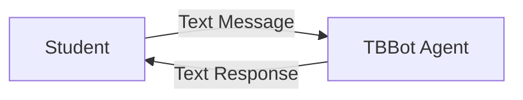
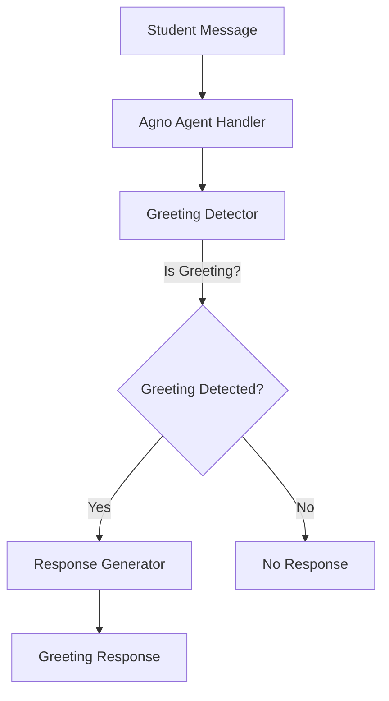

# Design Document: Greeting Agent

## Overview

The greeting agent is TBBot's first functional capability, providing a foundation for student-agent interaction. The agent detects greeting messages from students and responds with a standardized introduction. This design implements a simple pattern-matching approach using the Agno framework for agent orchestration.

The system consists of three main components:
1. A greeting detector that identifies greeting keywords in student messages
2. An agent handler that processes messages and coordinates responses
3. A response generator that produces the standardized greeting message

This minimal design establishes the architectural patterns that will be extended for future TBBot capabilities.

## Architecture

### System Context



### Component Architecture



The architecture follows a simple pipeline pattern:
- **Input Layer**: Receives text messages from students
- **Processing Layer**: Detects greetings using keyword matching
- **Output Layer**: Generates standardized greeting responses

### Technology Stack

- **Agent Framework**: Agno (Python-based agent orchestration)
- **Language**: Python 3.x
- **Testing**: scenario framework for unit tests
- **Dependency Management**: uv

## Components and Interfaces

### 1. Greeting Detector

**Purpose**: Identifies whether a student message contains a greeting

**Interface**:
```python
def is_greeting(message: str) -> bool:
    """
    Detects if a message contains a greeting keyword.
    
    Args:
        message: The student's input message
        
    Returns:
        True if message contains greeting keywords, False otherwise
    """
```

**Implementation Strategy**:
- Convert message to lowercase for case-insensitive matching
- Check for presence of greeting keywords: "hello", "hi", "hey"
- Return boolean result

**Keywords**: ["hello", "hi", "hey"]

### 2. Agno Agent Handler

**Purpose**: Orchestrates message processing using the Agno framework

**Interface**:
```python
class GreetingAgent:
    """
    TBBot agent that handles greeting detection and response.
    """
    
    def __init__(self):
        """Initialize the agent with Agno framework."""
        
    def process_message(self, message: str) -> str:
        """
        Process a student message and return appropriate response.
        
        Args:
            message: The student's input message
            
        Returns:
            Response string (greeting or empty)
        """
```

**Responsibilities**:
- Initialize Agno agent framework
- Receive student messages
- Coordinate greeting detection
- Return appropriate responses
- Handle initialization errors with logging

### 3. Response Generator

**Purpose**: Produces the standardized greeting response

**Interface**:
```python
def generate_greeting_response() -> str:
    """
    Generate the standard TBBot greeting message.
    
    Returns:
        The greeting response string
    """
```

**Response Format**: "Hi, my name is TBBot. I am here to help you with your questions"

## Data Models

### Message

```python
@dataclass
class Message:
    """Represents a student message."""
    content: str
    timestamp: float
```

### Response

```python
@dataclass
class Response:
    """Represents an agent response."""
    content: str
    timestamp: float
```

These simple data models provide structure for message handling and can be extended for future features (e.g., message IDs, conversation context).

